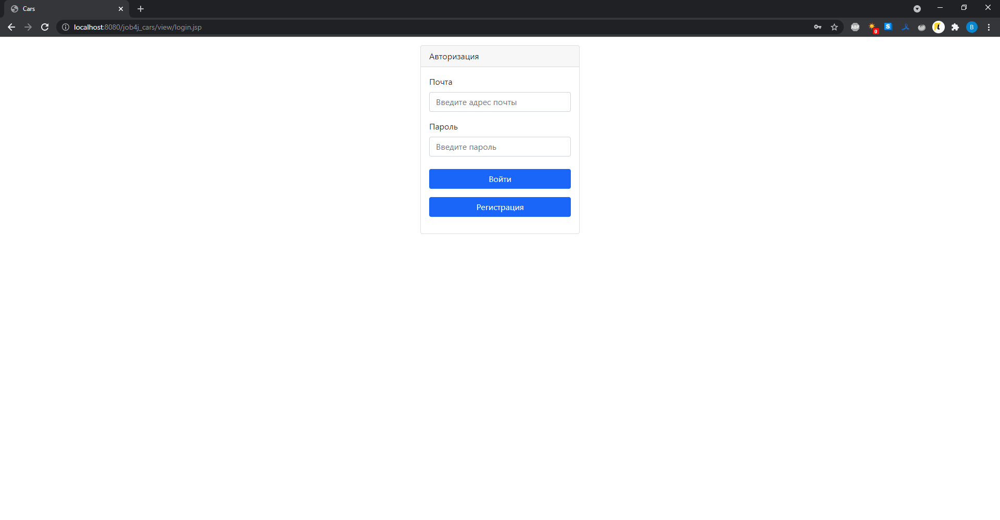

# Проект "Cars"

* [Описание](#описание)
* [Функционал](#функционал)
* [Технологии](#технологии)
* [Интерфейс](#интерфейс)
* [Автор](#автор)

## Описание

Проект представляет собой сайт для размещения объявлений по продаже автомобилей. Приложение построено на Java-сервлетах, с использованием JSP. Для
хранения данных применяется PostgreSQL и Hibernate.

## Функционал

* Регистрация и авторизация пользователя
* Добавление объявлений на главную страницу
* Загрузка фотографий
* Снятие автомобиля с продажи

## Технологии

* Java 14
* Servlets
* JSP
* JSTL
* PostgreSQL
* Hibernate
* Apache Tomcat Server
* Apache Commons FileUpload
* Travis CI
* Checkstyle
* Bootstrap

## Интерфейс

Форма авторизации.

Форма регистрации.

Форма создания объявления.

Главная страница с созданным объявлением.

Пользователь может менять статус своих объявлений.

При нажатии на кнопку "Снять с продажи", объявление получает статус "Продано".

При нажатии на кнопку "Выйти" происходит удаление пользователя из сессии. Неавторизованный пользователь может просматривать объявления.

## Автор

Тимофеев Вадим Витальевич

Java разработчик

vadimstr102@gmail.com
